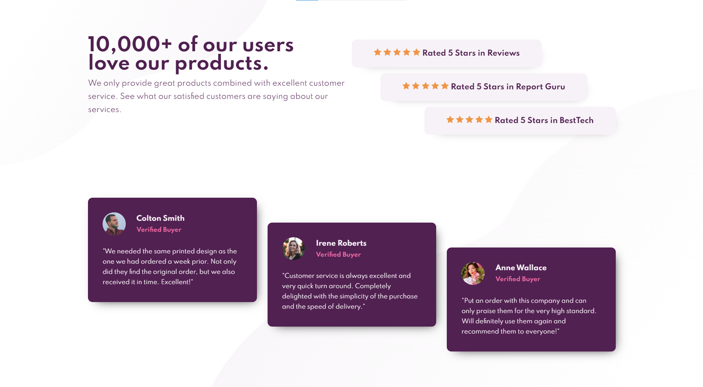
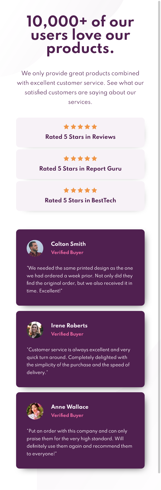

# Frontend Mentor - Social proof section solution

This is a solution to the [Social proof section challenge on Frontend Mentor](https://www.frontendmentor.io/challenges/social-proof-section-6e0qTv_bA). Frontend Mentor challenges help you improve your coding skills by building realistic projects.

## Table of contents

- [The challenge](#the-challenge)
- [Screenshot](#screenshot)
- [Links](#links)
- [Built with](#built-with)
- [Continued development](#continued-development)
- [Useful resources](#useful-resources)

### The challenge

Users should be able to:

- View the optimal layout for the section depending on their device's screen size

### Screenshot

### Links

- Solution URL : https://github.com/secretSilentPanda/social-proof-section
- Live Site URL: https://secretsilentpanda.github.io/social-proof-section/

### Built with

- Semantic HTML5 markup
- CSS custom properties
- Flexbox
- Mobile-first workflow

### Continued development

- It is CPU intensive when the window is BEING resized. Any solution to this? Its because I have animations on a breakpoint and my JS is constantly on the watch ;)
- The animation runs once the moment you resize the screen. After that its all fine. Any way to triger the animations only at the breakpoint and not when you start resizing?

### Useful resources

- https://animate.style/ - Easy CSS animations!

## Author

- Frontend Mentor - [@secretSilentPanda](https://www.frontendmentor.io/profile/secretSilentPanda)
